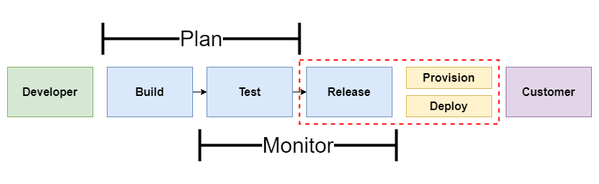

# Terraform Overview & Examples<!-- omit in toc -->

## Contents <!-- omit in toc -->

- [1. What's Terraform?](#1-whats-terraform)
- [2. First steps in terraform](#2-first-steps-in-terraform)
- [3. Terraform HCL - Basic](#3-terraform-hcl---basic)
  - [3.1. Variables Types](#31-variables-types)
    - [3.1.1. Simple types](#311-simple-types)
    - [3.1.2. Complex types](#312-complex-types)
  - [3.2. Outputting attributes](#32-outputting-attributes)
- [4. State](#4-state)
  - [4.1. Collaboration](#41-collaboration)
  - [4.2. Backend](#42-backend)
  - [4.3. Resume](#43-resume)
- [5. Datasources](#5-datasources)
- [6. Template provider](#6-template-provider)
- [7. Modules](#7-modules)
- [8. Provisioning software](#8-provisioning-software)
- [9. Scenarios](#9-scenarios)
- [10. Packer](#10-packer)
- [11. DevOps using terraform](#11-devops-using-terraform)
- [12. CDK Terraform](#12-cdk-terraform)
- [13. Command Overview](#13-command-overview)
  - [13.1. Commands](#131-commands)

# 1. What's Terraform?

- Infrastructure as **Code** (IaC).
- **Automation** of your infrastructure.
- Keep your infrastructure in a certain **state** (compliant).
  - Example: 2 web instances with 2 volumes, and 1 load balancer.
- Make your infrastructure **auditable**.
  - You can keep your infrastructure change history in a version control system like **GIT**.
- Ansible, Chef, Puppet, Saltstack have a focus on automating the **installation and configuration** of software.
  - Keeping the **machines** in compliance, in a certain state.
- Terraform can automate provisioning of the **infrastructure itself.**
  - Example: Using the AWS, DigitalOcean, Azure API.
  - Works well with automation software like ansible to install software after the infrastructure is provisioned.
- **Terraform is not fit to do configuration management on the software on your machines.**

# 2. First steps in terraform

- Spinning up an instance on AWS:
  - Open AWS Account.
  - Create IAM admin `arn:aws:iam::aws:policy/AdministratorAccess `user.
  - Create terraform file to spin up `t2.micro` instance.
  - Run `terraform apply`.

# 3. Terraform HCL - Basic

- Terraform HCL (HashiCorp Configuration Language) syntax.

## 3.1. Variables Types

- Terraform variables were completely reworked for the terraform 0.12 release.
- You can now have **more control over the variables**, and have **for and for-each loops**, which where not possible with earlier versions.
- You don't have to specify the type in variables, but it's recommended.
- Everything in one file is not great.
- Use variables to **hide secrets**.
  - You don't want the AWS credentials in your git repository.
- Use variables for elements that **might change**.
  - AMIs are different per region.
- Use variables to make it yourself easier to reuse terraform files.

### 3.1.1. Simple types

- Terraform's simple variable types:
  - `String`
  - `Number`
  - `Bool`
- Examples:

  ```
    # var.a-string OR "${var.a-string}"
    variable "a-string" {
      type    = string
      default = "Hello World!"
    }

    # var.this-is-a-number
    variable "this-is-a-number" {
      type    = number
      default = 10
    }

    # var.true-or-false
    variable "true-or-false" {
      type    = bool
      default = true
    }
  ```

### 3.1.2. Complex types

- Terraform's complex types:
  - `List(type)`
    - A `list` is always ordered, it'll always return 0, 1, 5, 2 and not 5, 1, 2, 0.
  - `Set(type)`
    - A `set` is like a list, but it doesn't keep the order you put it in, and can only contain unique values.
    - A `list` that has [5, 1, 1, 2] becomes [1, 2, 5] in a `set` (when you output it, terraform will sort it).
  - `Map(type)`
  - `Object({<ATTR NAME> = <TYPE>, ... })`
    - An `object` is like a `map`, but each element can have a different type.
  - `Tuple([<TYPE>, ...])`
    - An `tuple` is like a `list`, but each element can have a different type.
- The most common types are `list` and `map`, the other ones are only used sporadically.
- The ones you should remember are the simple variable types `string`, `number`, `bool` and the `list` & `map`.
- Examples:

  ```
    # var.this-is-a-list
    # var.this-is-a-list[0]
    # element(var.this-is-a-list, 2)
    # slice(var.this-is-a-list, 0, 2)
    variable "this-is-a-list" {
      type    = list(number)
      default = [12, 21, 32]
    }

    # var.this-is-a-map OR "${var.this-is-a-map}"
    # var.this-is-a-map["mykey1"]
    variable "this-is-a-map" {
      type = map(string)
      default = {
        mykey1 = "my_value_1",
        mykey2 = "my_value_2",
      }
    }

    # var.AWS_REGION
    variable "AWS_REGION" {
      type = string
    }

    # var.AMIS[var.AWS_REGION]
    variable "AMIS" {
      type = map(string)
      default = {
        "eu-west-1" = "my_ami_1",
        "sa-east-1" = "my_ami_2"
      }
    }

    # var.this-is-an-object
    # var.this-is-an-object.firstname
    variable "this-is-an-object" {
      type = object({
        firstname   = string,
        housenumber = number
      })
      default = {
        firstname   = "Jefté",
        housenumber = 112
      }
    }

    # var.this-is-a-tuple
    # var.this-is-a-tuple[1]
    variable "this-is-a-tuple" {
      type    = tuple([number, string, bool])
      default = [0, "test", false]
    }
  ```

## 3.2. Outputting attributes

- Terraform keeps **attributes** of all the **resources** you create.
  - Example: the `aws_instance` resource has the **attribute** `public_ip`.
- Those attributes can be **queried** and **outputted**.
- This can be useful just to output valuable information or to feed information to external software.
- Use **output** to display the public IP address of an AWS resource:

  ```
    resource "aws_instance" "my_ec2_via_terraform" {
      ami           = lookup(var.AMIS, var.AWS_REGION)
      instance_type = "t2.micro"
    }

    output "my_ip" {
      value = aws_instance.my_ec2_via_terraform.public_ip
    }
  ```

- You can refer to any attribute by specifying the following elements in your variable:
  - The resource type: `aws_instance`.
  - The resource name: `example`.
  - The attribute name: `public_ip`.
- You can also use the attributes in a script:

  ```
    resource "aws_instance" "my_ec2_via_terraform" {
      ami           = lookup(var.AMIS, var.AWS_REGION)
      instance_type = "t2.micro"

      provisioner "local-exec" {
        command = "echo ${aws_instance.my_ec2_via_terraform.private_ip} >> private_ips.txt"
      }
    }
  ```

- Useful for instance to start automation scripts after infrastructure provisioning.
- You can populate the IP addresses in an **ansible host** file.
- Or another possibility: execute a script (with attributes as argument) which will take care of a mapping of resource name and the IP address.

# 4. State

- Terraform keeps the **remote state** of the infrastructure.
- It stores it in a file called **terraform.tfstate**.
- There is also a backup of the previous state in **terraform.tfstate.backup**.
- When you execute `terraform apply`, a new terraform.tfstate and backup is **written**.
- This is how terraform **keeps track** of the **remote state**.
  - If the remote state changes and you hit terraform apply again, terraform will make changes to meet the correct remote state again.
  - Example: you terminate an instance that is managed by terraform, after terraform apply it will be started again.

## 4.1. Collaboration

- You can keep the terraform.tfstate in **version control** (git).
- It gives you a **history** of your terraform.tfstate file (which is just a big JSON file).
- It allows you to **collaborate** with other team members.
  - Unfortunately you can get conflicts when 2 people work at the same time.
- Local state works well in the beginning, but when you project becomes bigger, you might want to store your state **remote**.

## 4.2. Backend

- The **terraform state** can be saved remote, using the **backend** functionality in terraform.
- The default is a **local backend** (the local terraform state file).
- Other backends include:
  - Amazon S3 (with a locking mechanism using Amazon DynamoDB).
  - Consul (with locking).
  - Terraform Enterprise (the commercial solution).
- Using the backend functionality has definitely benefits:
  - Working in a team: it allows for collaboration, the remote state will always be available for the whole team
  - The state file is not stored locally. Possible sensitive information is now only stored in the remote state
  - Some backends will enable remote operations. The terraform apply will then run completely remote.
    - These are called the [enhanced backends](https://www.terraform.io/docs/backends/types/index.html).

## 4.3. Resume

- Using a **remote** store for the terraform state will ensure that you always have the **latest version** of the state
- It avoids having to `commit` and `push` the terraform.tfstate to version control.
- Terraform remote stores don’t always support **locking**.
  - The documentation always mentions if locking is available for a remote store.
  - Amazon S3 and consul support it.

# 5. Datasources

- For certain providers (like AWS), terraform provides datasources.
- Datasources provide you with dynamic information.
  - A lot of data is available by AWS in a structured format using their API.
  - Terraform also exposes this information using data sources.
- Examples:
  - List of AMIs.
  - List of availability Zones.
- Another great example is the datasource that gives you all IP addresses in use by AWS.
- This is great if you want to filter traffic based on an AWS region.
  - Example: Allow all traffic from amazon instances in Europe.
- Filtering traffic in AWS can be done using **Security Groups**.
  - Incoming and outgoing traffic can be filtered by protocol, IP range, and port.
  - Similar to iptables (linux) or a firewall appliance.
- Example:

  ```
    data "aws_ip_ranges" "south_america_ec2" {
      regions  = ["sa-east-1"]
      services = ["ec2"]
    }

    resource "aws_security_group" "from_south_america" {
      name = "from_south_america"

      ingress {
        from_port   = "443"
        to_port     = "443"
        protocol    = "tcp"
        cidr_blocks = data.aws_ip_ranges.south_america_ec2.cidr_blocks
      }
      tags = {
        CreateDate = data.aws_ip_ranges.south_america_ec2.create_date
        SyncToken  = data.aws_ip_ranges.south_america_ec2.sync_token
      }
    }
  ```

# 6. Template provider

- The template provider can help creating **customized configuration files**.
- You can build **templates based on variables** from terraform resource attributes (e.g. a public IP address).
- The result is a string that can be used as a variable in terraform:
  - The string contains a template.
  - Example: A configuration file.
- Can be used to create generic templates or cloud init configs.
- In AWS, you can pass commands that need to be executed when the instance starts for the first time.
- In AWS this is called "user-data".
- If you want to pass user-data that depends on other information in terraform (e.g. IP addresses), you can use the provider template.

# 7. Modules

- You can use modules to make your terraform more **organized**.
- Use **third party** modules.
  - Modules from github.
- **Reuse** parts of your code.
  - Example: To set up network in AWS - the Virtual Private Network (VPC).

# 8. Provisioning software

- There are 2 ways to provision software on your instances:
  1. You can build your own custom AMI and bundle your software with the image.
     - **Packer** is a great tool to do this.
  2. Another way is to boot standardized AMIs, and then install the software on it you need:
     - Using file uploads.
     - Using `remote-exec`.
     - Using automation tools like **Chef**, **Puppet**, **Ansible**.
- **Current state** for terraform with automation (Q4 2016):
  - Chef is integrated within terraform, you can add chef statements.
  - You can run **puppet agent** using `remote-exec`.
- For **Ansible**, you can first run terraform, and output the IP addresses, then run `ansible-playbook` on those hosts.
  - This can be automated in a workflow script.
  - There are 3rd party initiatives integrating **Ansible** with terraform.

# 9. Scenarios

| Scenario                              | Description                                |
| ------------------------------------- | ------------------------------------------ |
| [Scenario_1](/Laboratory/Scenario_1/) | Small example with good practices.         |
| [Scenario_2](/Laboratory/Scenario_2/) | Provisioning software (like EC2 User Data) |
| [Scenario_3](/Laboratory/Scenario_3/) | Provisioning Microsoft Windows Server      |
| [Scenario_4](/Laboratory/Scenario_4/) | Outputting attributes                      |
| [Scenario_5](/Laboratory/Scenario_5/) | Remote state using S3                      |
| [Scenario_6](/Laboratory/Scenario_6/) | Example using Datasource                   |

# 10. Packer

- Packer is a commandline tool that can build AWS AMIs based on templates.
- Instead of installing the software after booting up an instance, you can create an AMI with all the necessary software on.
- This can speed up boot times of instances
- It's a common approach when you run a horizontally scaled app layer or a cluster of something.
- It might not be very useful to do this on single instances that cannot be terminated (e.g. a database).

# 11. DevOps using terraform

- Terraform is a great fit in a DevOps minded organization.
- Tools like Terraform and Packer can be used in the Software Development Lifecycle:




# 12. CDK Terraform

- CDKTF is a **new way to provisioning using terraform**.
- Instead of writing code in .tf files using HCL (the HashiCorp Configuration Language), you can use a **programming language to write the provisioning code**.
  - Supported languages are currently:
    - TypeScript
    - Python
    - Java
    - C#
    - GO.
- In the same way you write application code, you can write code that **when executed with CDKTF, it will provision your infrastructure** (just like you are used to do with terraform apply).
  - To do this, CDKTF will translate (synthesize) your application code into terraform files that can then be deployed by terraform.
- Using CDKTF opens the way for developers to **write provisioning code** in **the same way as they develop their applicaiton**.
  - They can use the same tools (like their IDE) to write provisioning code.
  - They can add more logic to the code provisioning, by leveraging the existing tools of the programming language (conditionals, specific input/outputs, testing, abstractions).
- CDKTF is based on the **same technology as the AWS Cloud Development Kit (AWS CDK)**.

# 13. Command Overview

- Terraform is very much focussed on the **resource definitions**.
- It has a **limited toolset** available to modify, import, create these resource definitions.
  - Still, every new release there are new features coming out to make it easier to handle your resources.

## 13.1. Commands

- Try Terraform expressions at an interactive command prompt.
  - `terraform console`
- Prepare your working directory for other commands.
  - `terraform init`
- Create or update infrastructure.
  - `terraform apply`
- Destroy previously-created infrastructure.
  - `terraform destroy`
- Show changes required by the current configuration.
  - `terraform plan`
- Install or upgrade remote Terraform modules
  - `terraform get`
